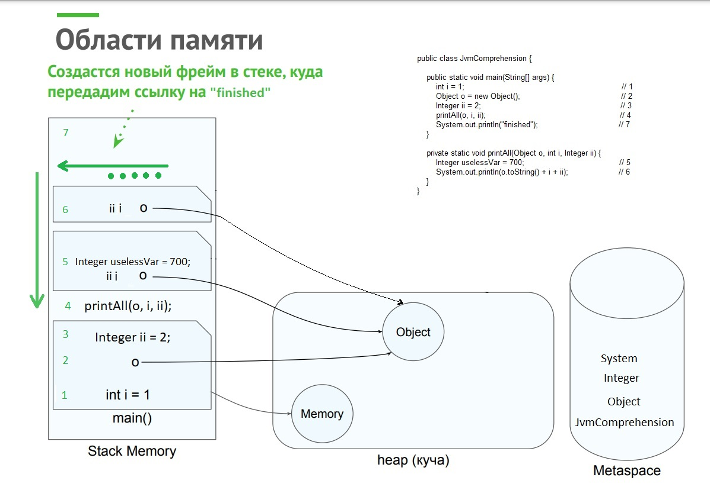

# Задача "Понимание JVM"

## Описание
Просмотрите код ниже и опишите (текстово или с картинками) каждую строку с точки зрения происходящего в JVM  

Не забудьте упомянуть про: 
- ClassLoader'ы, 
- области памяти (стэк (и его фреймы), хип, метаспейс)  
- сборщик мусора

## Код для исследования
```java

public class JvmComprehension {

    public static void main(String[] args) {
        int i = 1;                      // 1 
        Object o = new Object();        // 2
        Integer ii = 2;                 // 3
        printAll(o, i, ii);             // 4
        System.out.println("finished"); // 7
    }

    private static void printAll(Object o, int i, Integer ii) {
        Integer uselessVar = 700;                   // 5
        System.out.println(o.toString() + i + ii);  // 6
    }
}

```

## Ответы 

1. Application ClassLoader загрузил класс JvmComprehension в metaspace. Создан main frame (точка входа) в stack memory. В main frame помещается имя переменной "i" и её значение "1".
2. Bootstrap ClassLoader загружает класс Object в metaspace. В heap помещается экземпляра класса "o", а имя переменной и ссылка на него размещается в main frame.
3. Bootstrap ClassLoader загружает класс Integer в metaspace. В main frame помещается имя переменной "ii" и её значение "1".
4. Создаётся новый фрейм в стеке printAll frame, куда передается ссылка на значения в heap переменной "o" main frame и значения примитивных переменных "i" и "ii"
5. В printAll frame помещается имя переменной "uselessVar" и её значение "700"
6. Bootstrap ClassLoader загружает класс System, PrintStream и т д*. Создается новый фрейм out.println, туда передается ссылка переменные "i",
 "ii", "o". далее создается фрейм для метода сложения текстовых значений, далее фрейм o.toString() вычисляется, возвращаемся в метод
 вычисления выполняем (o.toString() + i + ii), возвращаемся выполняя System.out.println*. По завершении все удаляется из стека.
7. Создаем в куче объект "finished". Создаем новый фрейм в main frame out.println и передаем туда ссылку на объект в "finished". По завершению все удаляется

<графическое представление памяти при выполнении программы> 


> *Кроме указанных явно классов ClassLoader загружает и другие классы, которые используются в этой строке,
вот неполный список классов и методов которые использет строка:

```java 
PrintStream
println
print
write
ensureOpen

Writer
write

BufferedWriter
write
ensureOpen
write
min
write

String
getChars
checkBoundsBeginEnd
getChars
checkBoundsOffCount
getChars
isLatin1
getChars

StringLatin1
getChars
inflate

String
getChars

BufferedWriter
write
flushBuffer
ensureOpen
flushBuffer

OutputStreamWriter
write

StreamEncoder
write
ensureOpen
write
implWrite

InstrumentationImpl
transform
transformer
transform

HashMap
get
getNode
```
