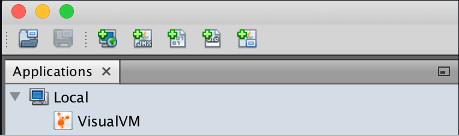
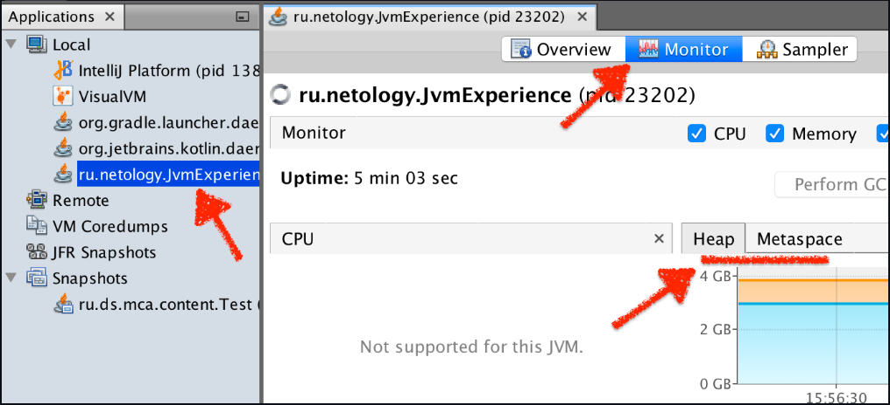
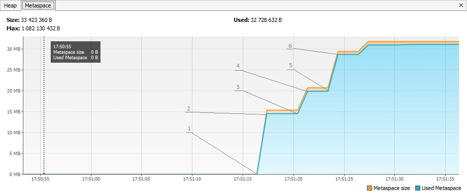
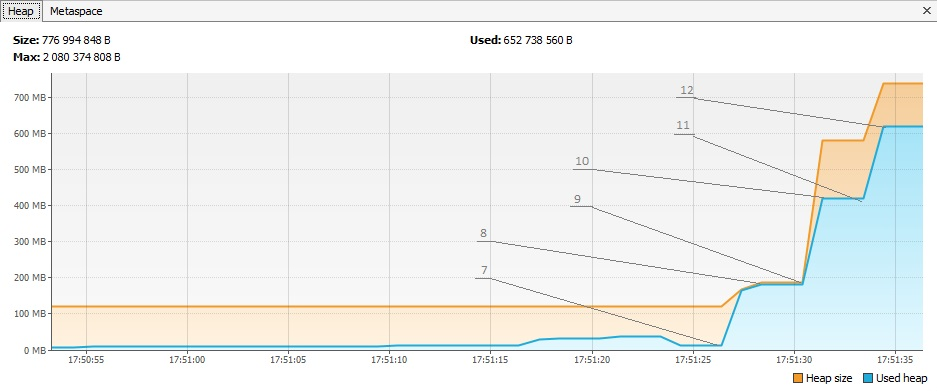
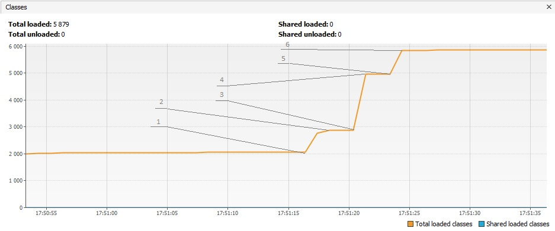

# Задача "Понимание JVM"

## Описание
Просмотрите код ниже и опишите (текстово или с картинками) каждую строку с точки зрения происходящего в JVM  

Не забудьте упомянуть про: 
- ClassLoader'ы, 
- области памяти (стэк (и его фреймы), хип, метаспейс)  
- сборщик мусора

## Код для исследования
```java

public class JvmComprehension {

    public static void main(String[] args) {
        int i = 1;                      // 1 
        Object o = new Object();        // 2
        Integer ii = 2;                 // 3
        printAll(o, i, ii);             // 4
        System.out.println("finished"); // 7
    }

    private static void printAll(Object o, int i, Integer ii) {
        Integer uselessVar = 700;                   // 5
        System.out.println(o.toString() + i + ii);  // 6
    }
}

```

## Ответы 

1. Application ClassLoader загрузил класс JvmComprehension в metaspace. Создан main frame (точка входа) в stack memory. В main frame помещается имя переменной "i" и её значение "1".
2. Bootstrap ClassLoader загружает класс Object в metaspace. В heap помещается экземпляра класса "o", а имя переменной и ссылка на него размещается в main frame.
3. Bootstrap ClassLoader загружает класс Integer в metaspace. В main frame помещается имя переменной "ii" и её значение "1".
4. Создаётся новый фрейм в стеке printAll frame, куда передается ссылка на значения в heap переменной "o" main frame и значения примитивных переменных "i" и "ii"
5. В printAll frame помещается имя переменной "uselessVar" и её значение "700"
6. Bootstrap ClassLoader загружает класс System, PrintStream и т д*. Создается новый фрейм out.println, туда передается ссылка переменные "i",
 "ii", "o". далее создается фрейм для метода сложения текстовых значений, далее фрейм o.toString() вычисляется, возвращаемся в метод
 вычисления выполняем (o.toString() + i + ii), возвращаемся выполняя System.out.println*. По завершении все удаляется из стека.
7. Создаем в куче объект "finished". Создаем новый фрейм в main frame out.println и передаем туда ссылку на объект в "finished". По завершению все удаляется

<графическое представление памяти при выполнении программы> 


> *Кроме указанных явно классов ClassLoader загружает и другие классы, которые используются в этой строке,
вот неполный список классов и методов которые использет строка:

```java 
PrintStream{println(), print(), write(), ensureOpen()}
Writer{write()};
BufferedWriter{write(),ensureOpen(), write() min(), write()};
String{getChars(), checkBoundsBeginEnd(), getChars(), checkBoundsOffCount, getChars(), isLatin1(),getChars()};
StringLatin1{getChars() ,inflate()}
String{getChars()}
BufferedWriter{write(), flushBuffer(), ensureOpen(), flushBuffer()}
OutputStreamWriter{write()}
StreamEncoder{write(), ensureOpen(),write(), implWrite()}
InstrumentationImpl{transform(), transformer(), transform()}
HashMap{get(), getNode()}
```

# Задача "Исследование JVM через VisualVM"

## Описание
Предлагаем вам изучить использование памяти через VisualVM при загрузке новых классов и создании новых объектов

## Инструкция
Скачайте и установите утилиту [VisualVM](https://visualvm.github.io/download.html).  
Откройте её и обратите внимание на раздел `Applications -> Local`


<графическое представление памяти при выполнении программы> 

Запульте и запустите проект [отсюда](https://github.com/Arsennikum/jvm-visualvm-experience).  
После запуска сразу же (у вас будет на это 30 сек, см. код) щелкните дважды по появившейся запущенной нашей программе в разделе `Local` (о котором упоминалось выше)  
Перейдите на вкладку `Monitor` и можете наблюдать метрики программы в реальном времени. Присмотритесь к разделам `Heap`, `Metaspace`   


Когда программа завершится, изучите вывод консоли и код программы (в код можете не погружаться, главное - метод main). Соотнесите с графиками в разделах `Heap`, `Metaspace` и `Classes`

Числовые значения в main методе можете менять по своему усмотрению в соответсвии с вашим железом и как вы считаете,
будет показательно.

Сделайте скриншоты графиков и отметьте на них с помощью простого графического редактора и текста, в какие моменты какие
действия программы происходили.  
Для выполнения задания нужно отметить на таймлайне графиков каждую строку, которую вывела в консоль программа и пояснить
её своими словами в тексте  
Данные скриншоты и текст отправьте в качестве домашнего задания (их также можно добавить в репозиторий. Для текста
можете использовать формат Markdown)

# Решение

### Точки программы

> 1 - 17:51:17.037526800: loading io.vertx
>
>2 - 17:51:17.416456200: loaded 529 classes
>
>3 - 17:51:20.421080700: loading io.netty
>
>4 - 17:51:20.972211600: loaded 2117 classes
>
>5 - 17:51:23.972456800: loading org.springframework
>
>6 - 17:51:24.148786200: loaded 869 classes
>
>// now see heap
>
>7 - 17:51:27.149570700: creating 5000000 objects
>
>8 - 17:51:27.409677700: created
>
>9 - 17:51:30.411412800: creating 5000000 objects
>
>10 - 17:51:30.608869900: created
>
>11 - 17:51:33.663931100: creating 5000000 objects
>
>12 - 17:51:33.893857: created

## metaspace


## heap


## class
